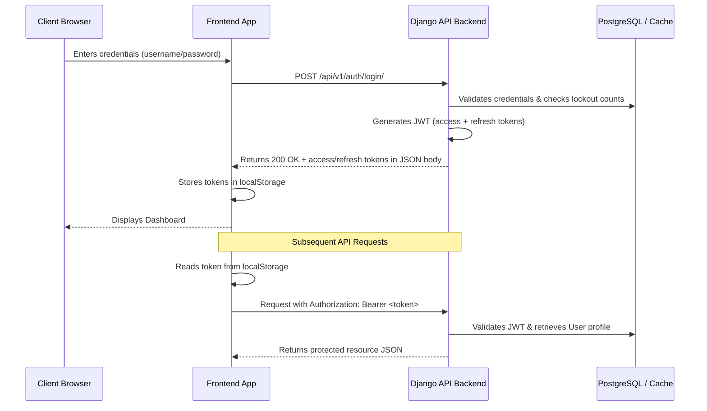
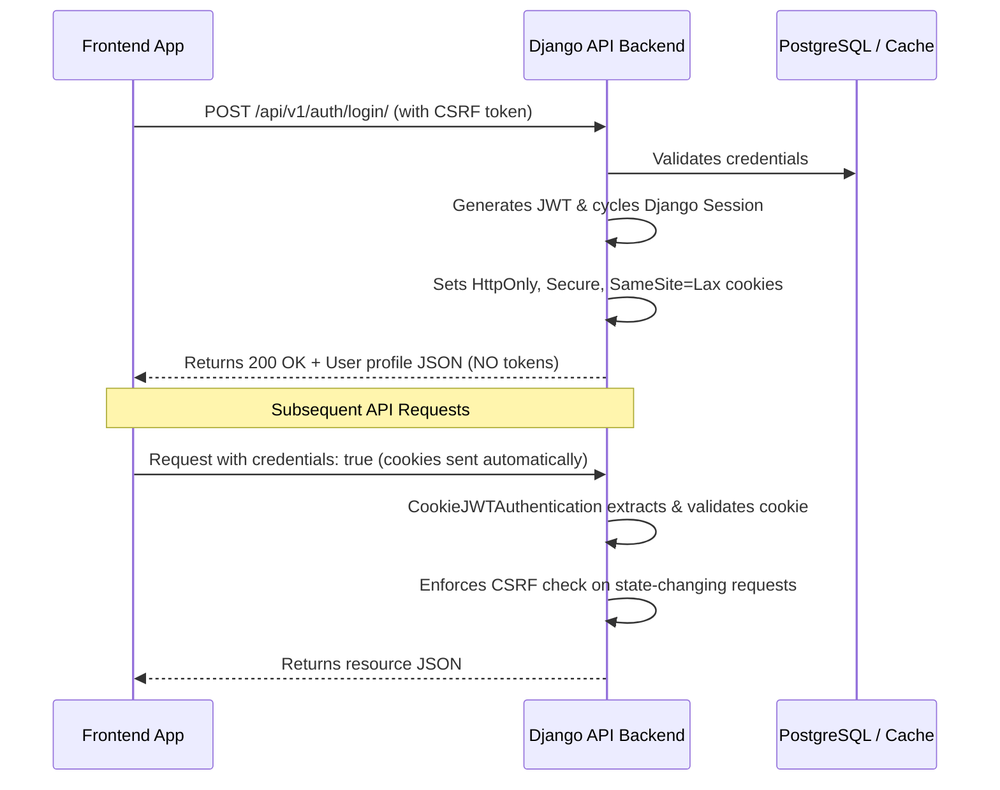

# PHASE 0: Authentication Security Analysis

This analysis maps the current state of authentication, token transmission, storage, and cross-origin controls in the Aurexion Technologies platform to design a secure cookie-based architecture.

---

## 🔍 1. Current Authentication Flow



### Key Technical Details of Current Flow
1. **Token Generation**:
   * Access and refresh tokens are generated in `LoginView` (located in [`views.py`](file:///c:/Users/ABC/Desktop/AURA/Aurexion_technologies/src/apps/authentication/views.py)) using Django REST Framework SimpleJWT.
2. **JSON Exposure**:
   * The response body contains the raw tokens:
     ```json
     {
       "refresh": "<refresh_token>",
       "access": "<access_token>",
       "user": { ... }
     }
     ```
3. **Frontend Storage**:
   * The frontend [`AuthProvider.tsx`](file:///c:/Users/ABC/Desktop/AURA/Aurexion_technologies/frontend/src/app/providers/AuthProvider.tsx) writes these tokens to `localStorage` under `aurexion_auth_token`.
4. **Header Attachment**:
   * The frontend [`interceptors.ts`](file:///c:/Users/ABC/Desktop/AURA/Aurexion_technologies/frontend/src/api/interceptors.ts) retrieves the token and adds it to the `Authorization` request header:
     ```javascript
     config.headers.Authorization = `Bearer ${token}`;
     ```

---

## ⚠️ 2. Identified Security Risks

1. **XSS-Based Token Theft**: 
   * Storing tokens in `localStorage` makes them readable by any JavaScript execution environment. A single cross-site scripting (XSS) vulnerability would allow an attacker to steal active access and refresh tokens.
2. **Insecure CORS Setting with Credentials**:
   * In [`settings.py`](file:///c:/Users/ABC/Desktop/AURA/Aurexion_technologies/src/config/settings.py), `CORS_ALLOW_ALL_ORIGINS = DEBUG` is active. Allowing credentialed requests alongside dynamic wildcard origin reflection is a severe cross-origin vulnerability.
3. **No CSRF Protection on API Requests**:
   * Because JWT header-based authentication is currently stateless, CSRF checks are bypassed on DRF endpoints. Once transitioned to cookies, state-changing requests (POST, PUT, PATCH, DELETE) will become vulnerable to CSRF hijack unless explicitly protected.

---

## 🍪 3. Existing Cookie & Session State

* **Cookies**: No cookies are set during the login or refresh flows.
* **Sessions**: Django's session framework (`django.contrib.sessions`) and middleware are included in the settings but remain unused on standard JWT-based API endpoints.

---

## ⚙️ 4. CORS & CSRF Configurations

* **CORS Settings**:
  * `CORS_ALLOWED_ORIGINS` has a list of local and remote domains.
  * `CORS_ALLOW_CREDENTIALS` is set to `True`.
  * `CORS_ALLOW_ALL_ORIGINS = DEBUG` is configured.
* **CSRF Settings**:
  * `CsrfViewMiddleware` is included in middleware, but DRF's JWT authentication class doesn't validate it.

---

## 🛠️ 5. Proposed Secure Cookie Architecture

To solve these issues, we will transition to **Server-Managed Cookie Authentication**:



### Modifications to Backend Settings
* **Secure Session Cookies**:
  * Set `SESSION_COOKIE_SECURE = True` in production.
  * Set `SESSION_COOKIE_HTTPONLY = True`.
  * Set `SESSION_COOKIE_SAMESITE = 'Lax'`.
* **CORS Hardening**:
  * Enforce `CORS_ALLOW_ALL_ORIGINS = False` in both development and production since credentials are used.

### Exact Files Requiring Modification

#### Backend Files:
1. [`src/config/settings.py`](file:///c:/Users/ABC/Desktop/AURA/Aurexion_technologies/src/config/settings.py):
   * Add cookie security settings.
   * Disable `CORS_ALLOW_ALL_ORIGINS` in debug mode when credentialed requests are allowed.
2. [`src/apps/authentication/authentication.py`](file:///c:/Users/ABC/Desktop/AURA/Aurexion_technologies/src/apps/authentication/authentication.py) **[NEW]**:
   * Create `CookieJWTAuthentication` class which inherits from SimpleJWT's `JWTAuthentication`.
   * Retrieve JWT from HttpOnly cookies (`access_token`).
   * Enforce CSRF checks on state-changing requests.
3. [`src/apps/portal/authentication.py`](file:///c:/Users/ABC/Desktop/AURA/Aurexion_technologies/src/apps/portal/authentication.py):
   * Change `ProfileJWTAuthentication` base class to `CookieJWTAuthentication`.
4. [`src/apps/authentication/views.py`](file:///c:/Users/ABC/Desktop/AURA/Aurexion_technologies/src/apps/authentication/views.py):
   * Refactor `LoginView` to set `access_token` and `refresh_token` as HttpOnly, Secure cookies and remove them from the JSON response. Enforce session rotation with `django_login`.
   * Create `LogoutView` to delete the cookies and call `django_logout`.
   * Refactor `TokenRefreshView` (as a custom subclass `CookieTokenRefreshView`) to read the refresh token from cookie, generate new tokens, and write them back into cookies.
5. [`src/apps/authentication/urls.py`](file:///c:/Users/ABC/Desktop/AURA/Aurexion_technologies/src/apps/authentication/urls.py):
   * Register the new logout view and update the refresh view endpoint.

#### Frontend Files:
1. [`frontend/src/api/axiosClient.ts`](file:///c:/Users/ABC/Desktop/AURA/Aurexion_technologies/frontend/src/api/axiosClient.ts):
   * Add `withCredentials: true`, `xsrfCookieName: "csrftoken"`, and `xsrfHeaderName: "X-CSRFToken"` configuration.
2. [`frontend/src/api/interceptors.ts`](file:///c:/Users/ABC/Desktop/AURA/Aurexion_technologies/frontend/src/api/interceptors.ts):
   * Remove the request interceptor block that appends `Authorization: Bearer <token>`.
3. [`frontend/src/app/providers/AuthProvider.tsx`](file:///c:/Users/ABC/Desktop/AURA/Aurexion_technologies/frontend/src/app/providers/AuthProvider.tsx):
   * Remove token storage and retrieval logic from `localStorage` (`aurexion_auth_token`). Keep non-sensitive user metadata storage if needed.
   * Call backend API for logout instead of just client-side state clearing.
4. [`frontend/src/features/authentication/services/authService.ts`](file:///c:/Users/ABC/Desktop/AURA/Aurexion_technologies/frontend/src/features/authentication/services/authService.ts):
   * Remove token fields from interface types.
   * Direct logout function to request backend `/auth/logout/` endpoint.
