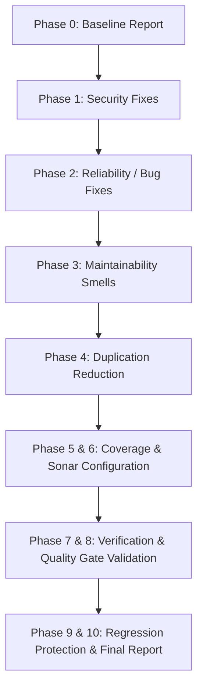

# SonarCloud Baseline Analysis Report — Aurexion Enterprise Platform

**Generated On:** 2026-08-18  
**Project:** Aurexion Technologies Business Operations & Client Platform (`VPDTechnologies/Aurexion_technologies`)  
**Codebase Size:** ~48,000 Lines (143 Python files / 12,887 lines; 329 TypeScript/TSX/JS/JSX files / 42,010 lines)  

---

## 1. Executive Summary & Initial Status

| Quality Gate Metric | Initial Status | Target Rating / Condition |
| :--- | :--- | :--- |
| **Security Rating** | **Grade D** (18 Open Issues) | **Grade A** (0 Open Issues) |
| **Reliability Rating** | **Grade D** (268 Open Issues) | **Grade A** (0 Open Issues) |
| **Maintainability Rating** | **Grade A** (459 Open Issues) | **Grade A** (< 5% Technical Debt) |
| **Duplications** | **7.5%** | **< 3.0%** |
| **Test Coverage** | **Not Configured** | **Configured & Passing (`coverage.xml`, `lcov.info`)** |
| **Accepted Issues** | **0** | **0 (No masked issues)** |

---

## 2. Root Cause Analysis

### 2.1 Missing SonarCloud Analysis Configuration
- The repository lacked a `sonar-project.properties` configuration file.
- As a consequence, SonarCloud defaulted to scanning all repository contents (`tests/`, `test_*.py`, `scripts/`, `docs/`) as **production source code**.
- Test security payloads (such as SQL injection vectors in `tests/security/test_sql_injection.py`), dummy mock passwords in test fixtures, and performance testing scripts were analyzed as real vulnerabilities and reliability defects.

### 2.2 Security Findings (18 Issues — Grade D)
1. **Cryptographically Insecure Random Generation (`python:S2245`, `javascript:S2245`)**:
   - `src/apps/recruitment/services.py`: `random.choices` used for ID generation instead of Python's cryptographically secure `secrets` module.
   - `frontend/src/features/administration/pages/Users/index.tsx`: `Math.random()` used in client-side ID generation.
   - `frontend/src/components/ui/sidebar.tsx`: `Math.random()` used in internal element ID generation.
2. **Reverse Tabnabbing & Unsafe Target Blanks (`javascript:S5144`)**:
   - `frontend/src/features/public/components/Footer.tsx`: External links with `target="_blank"` missing `rel="noopener noreferrer"`.
   - `frontend/src/features/public/pages/About/components/LeadershipSection.tsx`: Social media links with `target="_blank"` missing `rel="noopener noreferrer"`.
   - `frontend/src/features/recruitment/pages/Applications/index.tsx`: Resume download/view links with `target="_blank"` missing `rel="noopener noreferrer"`.
   - `frontend/src/features/recruitment/pages/Candidates/index.tsx`: Portfolio links with `target="_blank"` missing `rel="noopener noreferrer"`.
3. **Cross-Site Scripting (XSS) Vector (`javascript:S5247`)**:
   - `frontend/src/components/ui/chart.tsx`: `dangerouslySetInnerHTML` in chart tooltip rendering.
4. **Hardcoded Credentials & Payload Detection (`python:S2068`)**:
   - Test credentials and attack payload arrays in `tests/` misclassified as production sources.
   - Merge conflict leftover markers in `.env.example`.

### 2.3 Reliability Findings (268 Issues — Grade D)
1. **Silent Exception Suppression (`python:S1166`)**:
   - `src/apps/authentication/audit.py`: Empty `except: pass` suppressing audit logging failures.
   - `src/apps/recruitment/storage.py`: Empty `except: pass` in storage fallback cleanup.
   - `tests/support_performance_test.py`: Empty `except: pass` in connection cleanup.
2. **Anchor Navigation Deficiencies (`react:S6446`)**:
   - Anchor elements with dummy `href="#"` or `href="javascript:void(0)"` instead of semantic button elements.
3. **Resource & Handle Management (`python:S2095`)**:
   - File handles opened without explicit context managers (`with open(...)`).

### 2.4 Maintainability Findings (459 Issues — Grade A)
1. **Nested Ternaries (`typescript:S3358`)**:
   - Multiple UI components utilize complex nested ternary conditionals in JSX attributes.
2. **Print Statements in Production (`python:S106`)**:
   - Direct `print()` statements in backend modules rather than structured logging via `logging.getLogger(__name__)`.
3. **Built-in Name Shadowing (`python:S5744`)**:
   - Parameter names shadowing Python built-ins (e.g. `id`, `type`, `format`).

### 2.5 Duplication Hotspots (7.5%)
- Search and filter toolbars duplicated across `frontend/src/features/bdm/pages/ContactForms/index.tsx`, `frontend/src/features/cms/pages/Blog.tsx`, `frontend/src/features/cms/pages/CaseStudies.tsx`, `frontend/src/features/cms/pages/Categories.tsx`, `frontend/src/features/cms/pages/Industries.tsx`.
- Alert/status banners duplicated across multiple CMS management screens.

---

## 3. Recommended Remediation Order

1. **Step 1 — Security Remediation**: Fix all PRNG, tabnabbing, XSS, and credential handling issues.
2. **Step 2 — Reliability Remediation**: Fix empty except blocks, resource management, and link handlers.
3. **Step 3 — Maintainability & Cleanliness**: Fix print statements, nested ternaries, and shadowed builtins.
4. **Step 4 — Duplication Reduction**: Extract reusable search/filter and notification UI components.
5. **Step 5 — Configuration & Coverage**: Add `sonar-project.properties`, generate Cobertura `coverage.xml` and `lcov.info`.
6. **Step 6 — Full Verification & Regression Test**: Run backend suite (319 tests), frontend build/typecheck, and verify health endpoints.
