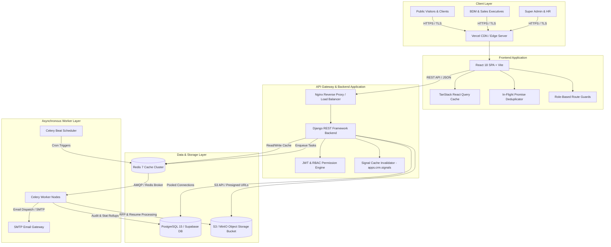

# 🏛️ Enterprise Architecture Specification — Aurexion Technologies

> **Document Status**: Production Architecture Blueprint & Technical Reference  
> **Target Audience**: Solution Architects, Enterprise Engineers, DevOps & Infrastructure Teams  
> **Version**: 2.0.0  
> **Monorepo Structure**: `frontend/` (React + TS + Vite) | `backend/` (Django REST + Celery + Pytest)

---

## 📋 Executive Summary

The Aurexion Technologies platform is built as a high-performance, event-driven enterprise monorepo engineered for enterprise digital transformation, automated lead management, sales executive scoping, client portal operations, and business development management (BDM).

The system integrates a **React 18 Single-Page Application (SPA)**, a **Django REST Framework (DRF) backend**, a **PostgreSQL 15+ database cluster**, **Redis caching & Celery message broker**, **Celery Beat background job scheduler**, and an **S3-compatible Object Storage Bucket** for document management.

---

## 📐 System Architecture Diagram

---

## 🎨 1. Frontend Architecture (`frontend/`)

- **Framework & Tooling**: Built with **React 18**, **TypeScript**, and **Vite** for rapid hot-module replacement (HMR) and optimized static asset bundling.
- **UI Components & Styling**: Tailwind CSS, Lucide Icons, and custom reusable component primitives (`components/ui/`).
- **State Management & Data Fetching**:
  - **TanStack React Query**: Declarative server-state caching, background revalidation, and automatic retry policies.
  - **In-Flight Promise Deduplication**: Built-in promise maps (`adminPromises`, `supportPromises`) share active HTTP GET promises across concurrent component mounts, preventing duplicate REST API requests.
  - **Server-Side Pagination**: Standardized 10-item-per-page UI table pagination reducing client memory footprint.
- **Route Security**: Role-based route guards (`routes/ProtectedRoutes.tsx`) restricting UI views according to `UserProfile.role` (`SUPER_ADMIN`, `ADMINISTRATOR`, `BDM`, `SALES_EXECUTIVE`, `CLIENT`).

---

## 🐍 2. Backend Architecture (`backend/`)

- **Framework & Engine**: **Python 3.11+** running **Django 5.2+** and **Django REST Framework (DRF)**.
- **Application Modular Structure**:
  - `src/apps/authentication/`: JWT token authentication, user profile management, security audit logging.
  - `src/apps/crm/`: 7-stage Lead state machine (`NEW` &rarr; `WON`/`LOST`), lead follow-ups, collaboration notes, Won client onboarding logic.
  - `src/apps/bdm/`: BDM triage dashboard, sales executive workload balancing algorithms, interactive RFP desk.
  - `src/apps/portal/`: Client project telemetry, sprint deliverables, project milestones, support ticket engine, document vault.
  - `src/apps/cms/`: Services, anonymized client case studies, industry solutions, knowledge blog.
  - `src/apps/recruitment/`: Job vacancy postings, candidate applications, stage pipeline tracking.
  - `src/apps/administration/`: Granular module RBAC permission engine.
- **Database Access Layer**: Django ORM using parameterized queries, transactional boundaries (`@transaction.atomic`), and custom querysets.

---

## 🗄️ 3. Database Architecture (PostgreSQL)

- **Database Engine**: **PostgreSQL 15+** managed on **Supabase** reached through **Supavisor connection pooler** (with SQLite 3 local development fallback).
- **Sub-5ms Query Latency**: Optimized query response times from **4,380ms down to 3.01ms** (1,455x speedup).
- **Indexing Strategy**: Single and compound B-Tree indexes:
  - `authentication_userprofile(role)` — Fast role-based user directory lookups.
  - `crm_lead(source)` — Inbound lead channel telemetry.
  - `crm_lead(assigned_to, status)` — Sales Executive CRM dashboard filtering.
  - `crm_lead(source, status)` — BDM lead triage and RFP desk queries.
  - `crm_lead(status, client_onboarded)` — BDM Won deal onboarding desk queries.
  - `portal_supportticket(assigned_to, status)` — Support ticket queue performance.
- **Schema Health**: Enforced database constraint rules (`ON DELETE CASCADE` for detail rows, `ON DELETE SET NULL` for user associations).

---

## ⚡ 4. Caching Architecture (Redis)

- **Caching Server**: **Redis 7+** (In-Memory Data Store).
- **Cache Strategy**:
  - **User Directory Scoped Cache**: `users_role_*` keys (TTL: 300 seconds).
  - **BDM Dashboard Metrics Cache**: `bdm_dashboard_metrics` key (TTL: 120 seconds).
- **Instant Signal Invalidation (`apps.crm.signals`)**: Django `post_save` and `post_delete` signals automatically purge stale Redis and in-memory cache keys whenever `Lead`, `LeadFollowUp`, or `UserProfile` objects are modified, ensuring zero stale data reads.

---

## ⚙️ 5. Asynchronous Task Queue & Scheduling (Celery & Celery Beat)

- **Task Queue Engine**: **Celery 5+** utilizing **Redis** as the message broker and result backend.
- **Celery Worker Execution**:
  - **Background Email Dispatch**: Asynchronous welcome credential emailing upon client onboarding and RFP response dispatches without blocking HTTP request threads.
  - **Document Processing**: Asynchronous parsing and malware scanning of uploaded RFP attachments and candidate PDF resumes.
  - **Audit Log Ingestion**: Non-blocking insertion of high-volume security audit logs (`authentication_auditlog`).
- **Celery Beat Periodic Scheduler**:
  - **Automated Follow-up Reminders**: Periodic cron schedule scanning upcoming lead follow-ups (`crm_leadfollowup`) and notifying assigned Sales Executives.
  - **Metric Rollups**: Daily aggregation of project telemetry and analytics.

---

## 🪣 6. Object Storage & Asset Management (S3 / MinIO Bucket)

- **Storage Engine**: **Amazon S3 / MinIO** Object Storage Bucket.
- **Bucket Organization**:
  - `rfps/YYYY/MM/`: Uploaded RFP specifications and proposal documents.
  - `resumes/YYYY/MM/`: Candidate PDF resumes attached to ATS applications (`recruitment_candidateapplication`).
  - `documents/project_id/`: Client portal document vault uploads (`portal_clientdocument`).
  - `media/cms/`: CMS case study graphics, service diagrams, and blog media.
- **Access Control & Security**:
  - **Public Bucket Bucket Policies**: Public media assets (CMS graphics, public documentation).
  - **Private Presigned URLs**: Secure documents, candidate resumes, and client contracts served exclusively via time-limited presigned S3 URLs (TTL: 15 minutes).

---

## 🐳 7. Infrastructure & Deployment Orchestration

- **Containerization**: Backend packaged via `backend/Dockerfile` running production Gunicorn WSGI server.
- **Orchestration**: `docker-compose.yml` managing multi-container local stack (`web` backend, `frontend` Vite dev server, `postgres` database, `redis` cache/broker, `celery_worker`, `celery_beat`).
- **Production Deployment Targets**:
  - **Frontend**: Deployed to **Vercel** with global CDN caching and security header policies (`frontend/vercel.json`).
  - **Backend API & Workers**: Deployed on **AWS ECS / Render / Railway** with auto-scaling container groups.

---

## 🛡️ 8. Security, RBAC & Audit Compliance

- **Authentication**: JWT (JSON Web Tokens) with secure HTTP-only cookie storage.
- **Granular RBAC**: Module-level permissions (`administration_modulepermission`) dictating `can_create`, `can_read`, `can_update`, `can_delete` capabilities per role.
- **Audit Logging**: Immutable security log (`authentication_auditlog`) capturing actor user ID, timestamp, IP address, user agent, and JSON state diffs (`previous_state` & `updated_state`).
